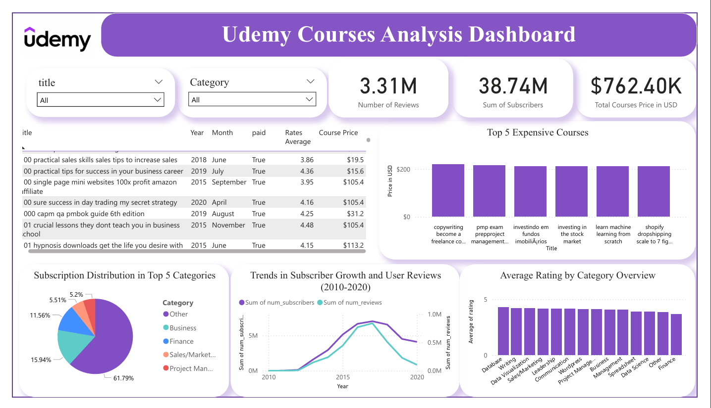

# **Udemy Finance Analysis Project**  

## 📌 About This Project  
This project analyzes Udemy finance courses by cleaning and transforming raw data, categorizing information, and visualizing key insights using **Python and Power BI**. The goal is to identify trends in course ratings, subscriptions, pricing, and user engagement over time.  

## 🛠️ Data Cleaning & Preparation  
The dataset contained multiple columns, including:  
 - id, title, url, is_paid, num_subscribers, avg_rating, avg_rating_recent, rating, num_reviews, is_wishlisted, num_published_lectures, num_published_practice_tests, created, published_time, discount_price__amount, 
   discount_price__currency, discount_price__price_string, price_detail__amount, price_detail__currency, price_detail__price_string
### 🔹 Steps Taken in Python:  
✔️ **Removed unnecessary columns** to focus on relevant data.  
✔️ **Cleaned and formatted date columns** for consistency.  
✔️ **Converted currency values to USD** (originally in INR).  
✔️ **Created a new category column** to improve visualization clarity.  
✔️ **Saved the cleaned and processed data into a new Excel file** for further analysis.  

### 📌 Libraries Used:  
- **Pandas** – Data manipulation & cleaning  
- **NumPy** – Numerical operations  
- **Matplotlib & Seaborn** – Data visualization
- **Plotly Express & Graph Objects** – Interactive visualizations  
- **Plotly Subplots** – Creating multi-chart layouts  
- **Scikit-learn (SimpleImputer)** – Handling missing data  
 

All processing steps are documented in the **Jupyter Notebook** file.  

---

## 📊 Data Visualization & Insights in Power BI  
Once the cleaned dataset was ready, Power BI was used to create interactive **dashboards** that reveal key insights.  

### 🔹 Visualizations & Insights:  
✅ **Total Sum of Reviews** – Understand course engagement.  
✅ **Total Sum of Subscribers** – Measure user interest.  
✅ **Total Course Price** – Evaluate pricing trends.  
✅ **Top 5 Most Expensive Courses** – Identify premium content.  
✅ **Subscription Distribution in Top 5 Categories** – Show category-wise engagement.  
✅ **Trends in Subscriber Growth & User Reviews (2010-2020)** – Analyze platform growth.  
✅ **Average Rating by Category** – Compare course quality across categories.  
✅ **Interactive Table with Course Information** – Displays course details dynamically.  
✅ **Slicers for Filtering Data** – Allow flexible data exploration.  
